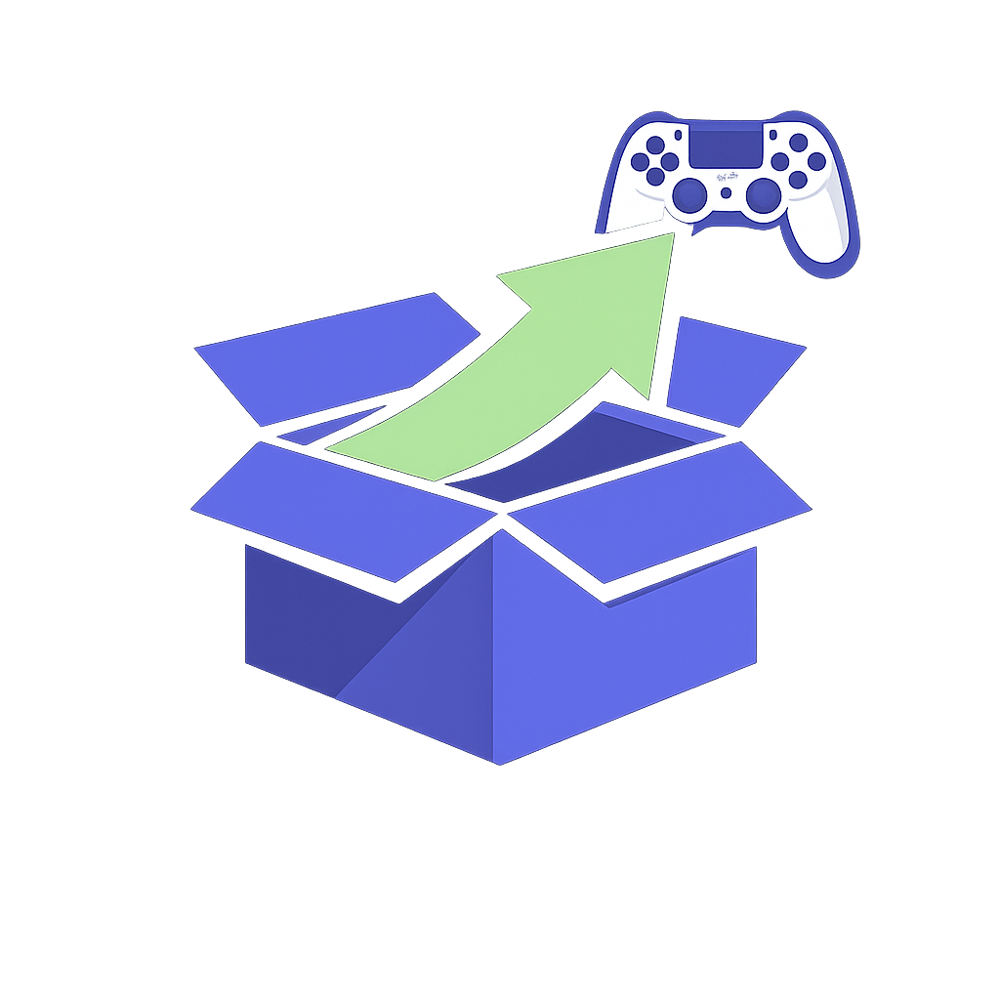
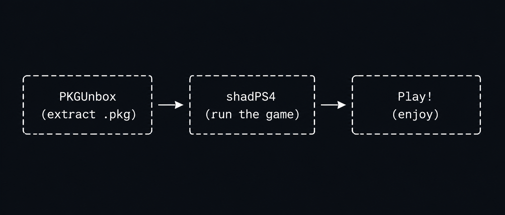
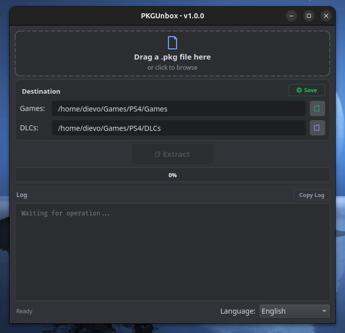
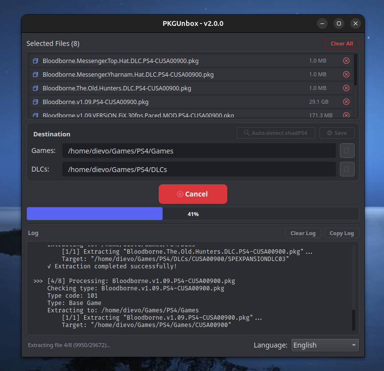
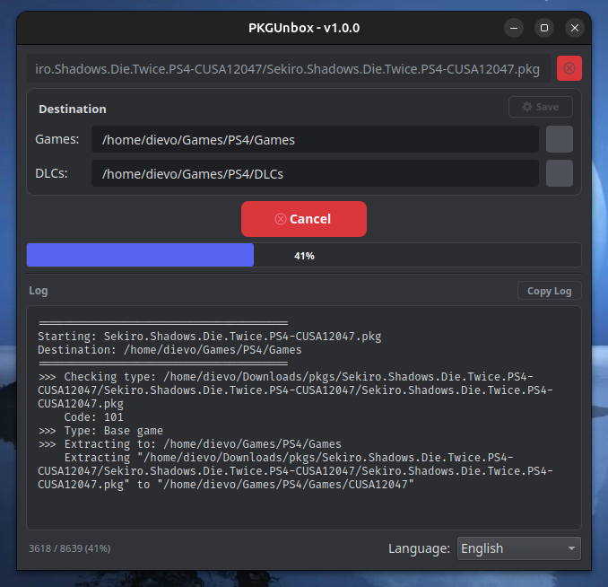
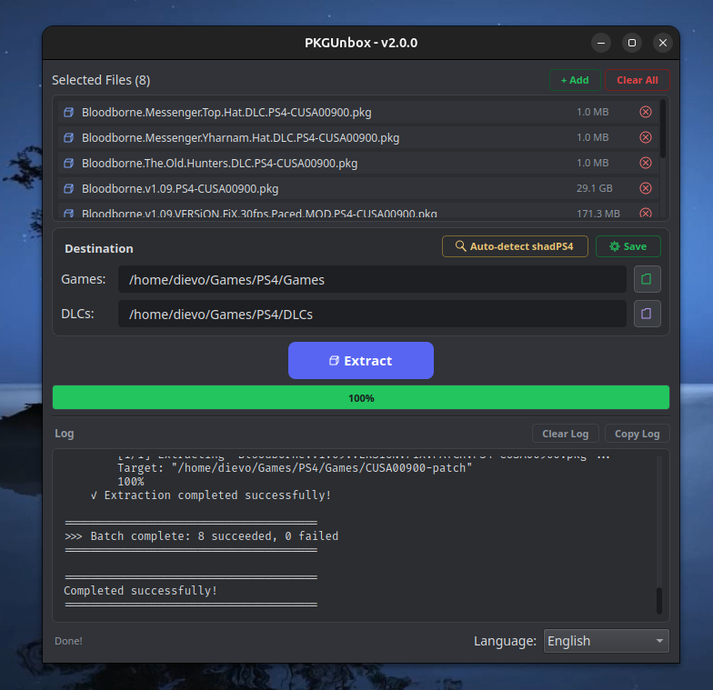

<p align="center">
  
</p>

<h1 align="center">PKGUnbox</h1>

<p align="center">
  <strong>Unbox your PS4 games. Done.</strong>
</p>

<p align="center">
  
  
  
  
  <a href="https://github.com/dievo/PKGUnbox/actions/workflows/build.yml"></a>
</p>

---

A standalone tool that extracts PS4 `.pkg` files — base games, updates, and DLCs.
No bloat. No library management. Just extract and play.

## Why PKGUnbox?

The [shadPS4 emulator](https://github.com/shadps4-emu/shadPS4) removed PKG
extraction from its core to focus on emulation. This left users without a
built-in way to prepare their game files.

**PKGUnbox fills that gap.**

<p align="center">
  
</p>

- **Standalone** — PKG parser and crypto derived from shadPS4, fully decoupled at runtime
- **One job** — extract PKG files. That's it. Open, extract, close.
- **Works everywhere** — Linux AppImage, Windows .exe, no dependencies needed

## Screenshot

<p align="center">
  
</p>

## Download

Go to [Releases](../../releases) and download the latest version.

| Platform | File | Requirements |
|----------|------|-------------|
| **Linux** | `PKGUnbox-linux-x86_64.AppImage` | None (self-contained) |
| **Windows** | `PKGUnbox-windows-x64.zip` | None (self-contained) |

## Quick Start

### Linux (AppImage)

The AppImage works as **both GUI and CLI** — no separate binaries needed.

```bash
chmod +x PKGUnbox-linux-x86_64.AppImage

# GUI — double-click or run without arguments
./PKGUnbox-linux-x86_64.AppImage

# CLI — run with arguments in a terminal
./PKGUnbox-linux-x86_64.AppImage /path/to/file.pkg [output_dir]
```

The wrapper script auto-detects the mode: arguments present → CLI, no arguments → GUI.

### Windows

Extract the `.zip` and double-click `pkgunbox-gui.exe` (GUI) or run `pkgunbox.exe` from a terminal (CLI).

### CLI (all platforms)

```bash
# Linux (via AppImage)
./PKGUnbox-linux-x86_64.AppImage /path/to/file.pkg /path/to/output/

# Windows
pkgunbox.exe /path/to/file.pkg /path/to/output/

# From a local build (all platforms)
./pkgunbox /path/to/file.pkg /path/to/output/

# Extract multiple PKGs
./pkgunbox game.pkg dlc.pkg update.pkg /path/to/output/

# Check PKG type (101=base, 102=update, 103=DLC)
./pkgunbox /path/to/file.pkg --check-type
```

## Features

| Feature | Description |
|---------|-------------|
| **Drag & Drop** | Drop `.pkg` files directly onto the window (multiple supported) |
| **Auto Detection** | Automatically detects PKG type (base, update, DLC) |
| **Auto-detect shadPS4** | One-click config detection for shadPS4 paths |
| **Progress Bar** | Visual feedback — blue during extraction, green on completion |
| **Copy Log** | One-click copy of the full extraction log for debugging |
| **Clear Log** | Clear log contents with one click |
| **Dark Theme** | Easy on the eyes, with blurple accent colors |
| **Multi-language** | English, Português, Español — with proper accents |
| **Save Directories** | Remember your Games/DLCs paths across sessions |
| **CLI Multi-file** | Extract multiple PKGs in a single command |

### GUI Walkthrough

| Step | What you see |
|------|-------------|
| **1. Drop** | Drag a `.pkg` file or click to browse |
| **2. Configure** | Set Games and DLCs dirs — or click **Auto-detect shadPS4** to fill them automatically |
| **3. Extract** | Click Extract — watch the progress bar and live log |
| **4. Done** | Green bar, success message, log ready to copy |

<p align="center">
  <table>
    <tr>
      <td align="center"></td>
      <td align="center"></td>
    </tr>
    <tr>
      <td align="center"></td>
      <td align="center"></td>
    </tr>
  </table>
</p>

## CLI Reference

```
Usage: pkgunbox <file.pkg> [output_dir] [options]
       pkgunbox <file1.pkg> <file2.pkg> ... [output_dir]

       On Linux, replace pkgunbox with the AppImage:
       ./PKGUnbox-linux-x86_64.AppImage <file.pkg> [output_dir]

Arguments:
  file.pkg        One or more PS4 .pkg files to extract
  output_dir      Output directory (default: next to each .pkg)

Options:
  --output DIR    Explicit output directory for all files
  --check-type    Print PKG type and exit (101=base, 102=update, 103=DLC)
  --help          Show help message

Examples:
  # Linux — extract via AppImage
  ./PKGUnbox-linux-x86_64.AppImage game.pkg /output

  # Linux — check type via AppImage
  ./PKGUnbox-linux-x86_64.AppImage game.pkg --check-type

  # Windows — extract via CLI executable
  pkgunbox.exe game.pkg /output

  # Local build — extract
  ./pkgunbox game.pkg /output

  # Local build — extract multiple files
  ./pkgunbox game.pkg dlc.pkg update.pkg /output

  # Local build — extract with glob
  ./pkgunbox *.pkg /output

Exit codes:
  0   Success
  1   Error (file not found, invalid PKG, etc.)
```

## Building from Source

### Prerequisites

- CMake >= 3.5
- C++23 compiler (GCC or Clang)
- Qt6 (Widgets, Core, Gui) — for GUI
- zlib >= 1.3
- Git (for submodule)

### Clone

```bash
git clone --recurse-submodules https://github.com/dievo/PKGUnbox.git
cd PKGUnbox
```

### Build (Linux)

```bash
cd extractor/build

# First time: build everything (crypto lib + binaries)
./buildall

# After code changes: rebuild only
./lbuild
```

### Generate AppImage (Linux)

```bash
cd extractor/build

# Build + package into a single .AppImage file
./build_appimage.sh --rebuild
```

The AppImage is fully self-contained — no dependencies needed. It works as both
GUI and CLI: double-click to open the GUI, or run from a terminal with arguments
for CLI mode.

```bash
# GUI
./PKGUnbox-linux-x86_64-*.AppImage

# CLI
./PKGUnbox-linux-x86_64-*.AppImage /path/to/file.pkg
```

### Build (Windows)

On Windows, use MSYS2/MinGW or Visual Studio with Qt6 installed:

```bash
cd PKGUnbox/extractor

# Configure
cmake -B build -G "MinGW Makefiles" -DCMAKE_BUILD_TYPE=Release

# Build crypto lib
cd ../externals/cryptopp && make
cp libcryptopp.a ../../extractor/build/

# Build project
cd ../../extractor/build
cmake --build . --config Release
```

Or use the convenience scripts (same as Linux):

```bash
cd PKGUnbox/extractor/build
./lconf && ./cryptobuild && ./lbuild
```

### Run

From a local build (raw binaries):

```bash
./pkgunbox /path/to/file.pkg    # CLI
./pkgunbox-gui                   # GUI
```

From an AppImage (Linux):

```bash
./PKGUnbox-linux-x86_64-*.AppImage                         # GUI (no args)
./PKGUnbox-linux-x86_64-*.AppImage /path/to/file.pkg       # CLI
```

## Platform Support

| Platform | Format | Minimum | Notes |
|----------|--------|---------|-------|
| **Linux** | AppImage | glibc >= 2.35 | Ubuntu 22.04+, Fedora 36+ |
| **Windows** | .exe (ZIP) | Windows 10 | Qt6 requirement |

## How it fits in the ecosystem

```
shadPS4 (emulator)
  └── Runs games

PKGUnbox (companion tool)
  └── Extracts PKGs for shadPS4
```

PKGUnbox is **not** a game manager. It does one thing: extract PKG files into
the format shadPS4 expects. Then you close it.

## Credits

- **[shadPS4](https://github.com/shadps4-emu/shadPS4)** — the emulator PKGUnbox complements; PKG parser and crypto code derived from its codebase
- **[shadPS4Plus](https://github.com/AzaharPlus/shadPS4Plus)** — fork that provided the original CLI extractor

## Legal

PKGUnbox is intended for extracting PKG files that you legally own — games you
purchased, backups of your own discs, or homebrew content you created. We do
not encourage or condone piracy. Use this tool responsibly and in compliance
with applicable laws in your region.

## License

GPL-2.0-or-later
